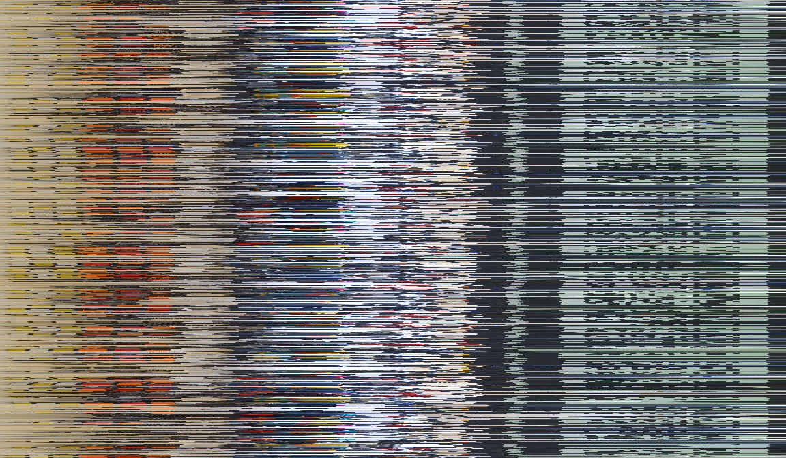
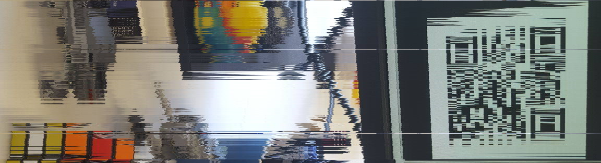
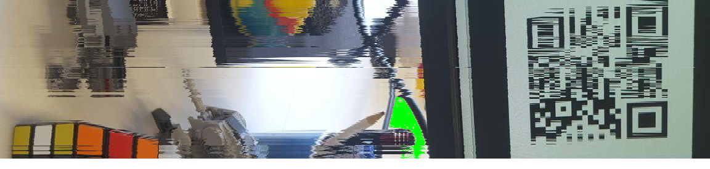

## Tuenti challenge 8

These are my solutions to some of the problems from the 8th tuenti challenge (2018). All of them are in Go. The complete statements of the problems can be found at https://contest.tuenti.net.

* Problem 5

### Problem 5 DNA Slicer

In this problem we received some slices of DNA and we had to find the ones that formed a double helix. For example,
there was TAC, TA, CGAT, GATCG, GAT and ATG. In that case the following pieces formed a double helix:

    TAC GAT
    TA CGAT

while GATCG and ATG were just noise. So the solution was 1, 2, 3, 5.

A way to work this one out was to think of the DNA as growing. Say that we had already matched TAC and CGAT

    TAC
      CGAT

If this couple belongs to a solution, then we have to find a DNA slice finishing in TA and a DNA slice starting
in GAT. We can choose either GATCG or GAT. If we choose GATCG, we would have to keep looking for a DNA slice
starting in CG.

    TAC GATCG
      CGAT

Only question is were to start. We can start with all the possible options, that is for slice TAC we look for
slices starting in 'TAC', for slices ending in 'T' and slices staring in 'AC', 'TA' and 'C', and 'TAC'.

The struct defined in go would be:

    type growingMatching struct {
    	startString, endString string
    	remainingParts map[int]bool
    }

### Problem 6 Button Hero

This challenge reminded a lot to Guitar Hero, we had to press the keys as the notes arrived and seek the maximum score.

First thing was to use the time as units, so each note was represented in the time it was present. For example, if a note
started at x = 10, with speed 2 and length 4, it was basically the same as saying that the note was present between t = 5 and t = 7.

Once we have changed the units, we make a graph by connecting a note with all the possible notes we can do next:

A winning strategy will be a path jumping from one note to the next that maximizes the score. Note that we do not need to connect the first note with the last,
 it cannot be a maximal score since we could always go through a note in the middle. Now we apply Dijkstra and we are done

### Problem 9 Scrambled photo

In this problem an img with a QR code was provided. The photo had been scrambled, so that columns of pixels had be shuffled.

The solution I implemented was really nasty. It was semi-manual process very tiring, but eventually it gave the solution, which is what matters.
The idea was the following: create a pallete of colours, say black and white and for each column of pixels find the first pixel that is closer to white than black, sort by that index and you will get
the img ordered.

Of course that idea was too naive. There was a lot of stuff in the pictures and while it was possible to recognize that there was a QR code, it was not possible to read it. So this was before:

And this was after (regions without code have been removed):

So the previous process was generalized: choose a range of pixels in x and y directions. Choose a palette of colours and from that palette one particular color.
In that box find the first pixel with the selected color and sort those lines by that pixel. Everything outside of the box you leave it like that (that is, do a stable sort).
This approach combined very well with fuzzy selection in gimp. I would choose a region, for example next to the cable.
Color it in green and then apply the algorithm to that part. Repeat again:

