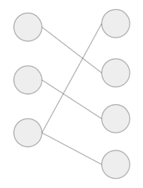

## Tuenti challenge 8

These are my solutions to some of the problems from the 8th tuenti challenge (2018). All of them are in Go. The complete statements of the problems can be found at https://contest.tuenti.net.

* Problem 5

### Problem 5 DNA Slicer

In this problem we received some slices of DNA and we had to find the ones that formed a double helix. For example,
there was TAC, TA, CGAT, GATCG, GAT and ATG. In that case the following pieces formed a double helix:

    TAC GAT
    TA CGAT

while GATCG and ATG were just noise. So the solution was 1, 2, 3, 5.

A way to work this one out was to think of the DNA as growing. Say that we had already matched TAC and CGAT

    TAC
      CGAT

If this couple belongs to a solution, then we have to find a DNA slice finishing in TA and a DNA slice starting
in GAT. We can choose either GATCG or GAT. If we choose GATCG, we would have to keep looking for a DNA slice
starting in CG.

    TAC GATCG
      CGAT

Only question is were to start. We can start with all the possible options, that is for slice TAC we look for
slices starting in 'TAC', for slices ending in 'T' and slices staring in 'AC', 'TA' and 'C', and 'TAC'.

The struct defined in go would be:

    type growingMatching struct {
    	startString, endString string
    	remainingParts map[int]bool
    }

### Problem 6 Button Hero

This challenge reminded a lot to Guitar Hero, we had to press the keys as the notes arrived and seek the maximum score.

First thing was to use the time as units, so each note was represented in the time it was present. For example, if a note
started at x = 10, with speed 2 and length 4, it was basically the same as saying that the note was present between t = 5 and t = 7.

Once we have changed the units, we make a graph by connecting a note with all the possible notes we can do next:

<!--  -->

A winning strategy will be a path jumping from one note to the next that maximizes the score. Note that we do not need to connect the first note with the last,
 it cannot be a maximal score since we could always go through a note in the middle. Now we apply Dijkstra and we are done

### Problem 9 Scrambled photo

In this problem an img with a QR code was provided. The photo had been scrambled, so that columns of pixels had be shuffled.

The solution I implemented was really nasty. It was semi-manual process very tiring, but eventually it gave the solution, which is what matters.
The idea was the following: create a pallete of colours, say black and white and for each column of pixels find the first pixel that is closer to white than black, sort by that index and you will get
the img ordered.

Of course that idea was too naive. There was a lot of stuff in the pictures and while it was possible to recognize that there was a QR code, it was not possible to read it. So this was before:

<!--  -->

And this was after (regions without code have been removed):

<!--  -->

So the previous process was generalized: choose a range of pixels in x and y directions. Choose a palette of colours and from that palette one particular color.
In that box find the first pixel with the selected color and sort those lines by that pixel. Everything outside of the box you leave it like that (that is, do a stable sort).
This approach combined very well with fuzzy selection in gimp. I would choose a region, for example next to the cable.
Color it in green and then apply the algorithm to that part. Repeat again:

<!--  -->

<!--  -->

### Problem 11 Lasers

In this problem we were given a rectangle with diamonds. We could place lasers in each row or column. We had to
find the most number of lasers that we could fit without covering a diamond with two lasers.

<!--  -->

A nice way to see this problem was a graph. Each row and column would be a node. They would be connected if there was a
diamond in that row and column. In the previous image the corresponding graph was

<!--  -->

We are looking for the maximum number of nodes that are not connected by edges. This is a very general problem that can be easily found in
wikipedia. It is called the [independence Number](https://en.wikipedia.org/wiki/Independent_set_(graph_theory)), for general graphs it is `NP`-complete.
However, for bipartite graphs it can be computed using the maximum flow (number of vertices minux the max flow). One possible way to compute the maximum flow is using [Hopcroft Karp](https://en.wikipedia.org/wiki/Hopcroft%E2%80%93Karp_algorithm),
there are tons of implementations on the internet, and it is not hard to adapt. The growth of the algorithm is `O(sqrt(V)E` so it can easily cope with the limits in the problem.

### Problem 13 pieces

The solution for this problem is messier to explain, so I've left for the end.

In this problem we are given an integer and we need to compute how many ways we can split a board of 3xn so that each piece touche
the upper and the lower part. For example for n = 3 these are all the possibilities

The solution consisted in two parts. First finding a recursion and then some nasty manipulations in
summations to reduce the order of the problem. Unluckily github does not allow LaTeX so it
is hard to explain it without proper notation.

The key insight for the recursion is that narrow modifications of a piece don't really affect.

In the previous image, the base case is where we have a 2x3 rectangle for red.
We can carve out some parts of it that yellow stays essentially the same. It needs to be connected so it still has to pass through
the corners to turn so it doesn't matter if it extends a little bit.

There is an extra case which is when the modification is not narrow.

In the img there we took out two squares out of the red block that were together.
In that case yellow has enough space to turn so that blue can be modified.

That means that everything we need to do the computations is a function on two parameters:
`A(i, j)` where i is the essentially the lower limit of the tile and j is essentially the upper limit of the tile.
In the previous examples, in the first set the red was `(2, 2)` and in the second set of examples it was
`(3, 2)`.

We can find a recursion of `A(n, n)` (the number we are looking for) in terms of `A(i, j)` with `i < j < n`.
 I won't write the recursion, since there is no LaTeX, but in code it looks like:

    type Couple [2]int

    func computeCouple (couple Couple) int {
        total := 1
        for i:= 1; i < couple[0]; i++ {
            coeff := ((couple[0] - i) * (couple[1] - i) + (couple[0] - i - 1)) * computeCouple(Couple{i, i})
            total = add(total, coeff)
            for j := i + 1; j < couple[0]; j++ {
                coeff1 := (couple[0] - j) + (couple[1] - j - 1))
                coeff2 := (couple[0] - j) + (couple[0] - j - 1))
                coeff3 := (coeff1 + coeff2) * computeCouple(Couple{i, j})
                total = add(total, coeff3)
            }
        }

        return total
    }

The coefficients that multiply computeCouple are all the equivalent ways of doing it. In the previous examples we were computing `A(4, 4)` and for red position of `A(2, 2)`
there were 5 equivalent ways which is `(couple[0] - i) * (couple[1] - i) + (couple[0] - i - 1) = (4 - 2) * (4 - 2) + (4 - 2 - 1) = 5`.

This algorithm worked but it was too slow. After some algebraic manipulation, it turned out that `A(i, j) = A(i, i) + (j - i) * C(i)` for some function `C(i)`.
A recursion was found for that `C` and the problem solved.

    func computeMagicConstant (n int) int {
    	total := computeMagicConstant(n - 1)
    	total = total + solveI(n- 1)

    	for i := 1; i < n - 1; i++ {
    		total = total + (n - 1 - i) * computeMagicConstant(i)
    		total = total + 2 * solveI(i)
    	}
    	return  total

    }

